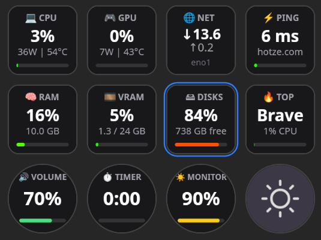

# MingInfo - Linux Stream Deck Dashboard

**MingInfo** is a high-performance system dashboard for Linux, optimized for real-time monitoring and Stream Deck + (Encoder) support.

## ✨ Features
* **Smart Monitoring:** CPU (Watts/Temp), AMD GPU (Usage/VRAM), RAM, and intelligent Disk aggregation (BTRFS-aware).
* **High-Precision Ping:** Accurate sub-1ms latency detection (no 1.1.1.1 fiber glitch).
* **Encoder Support:** Dials for Volume (WirePlumber), Monitor Brightness (DDC/CI), and Timer.
* **Top Process:** Instantly identifies the heaviest CPU consumer.

## 🛠️ Requirements
* **Runtime:** `nodejs`, `npm`
* **Audio:** `wireplumber`
* **Monitor:** `ddcutil`
* **Temp/Power:** `lm-sensors`, `zenergy` (optional for AMD Watts)

## 📥 Installation

### OpenDeck (Recommended)
1. Download the `minginfo-v1.1.zip` from the [Releases](https://github.com/kahikara/minginfo/releases) page.
2. In **OpenDeck**, click **"Import Plugin"** and select the ZIP file.

### Permissions
For monitor brightness control (DDC/CI) to work:
```bash
sudo usermod -aG i2c $USER


