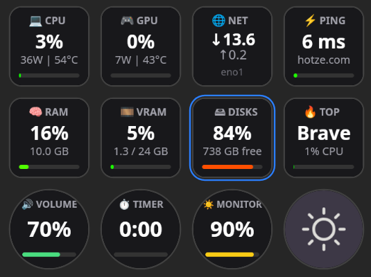

# Redline Monitor

**Redline Monitor** is an AMD focused Linux monitoring plugin built specifically for **OpenDeck**.

## Features

* CPU load, temperature, and power
* AMD GPU usage, VRAM, and power
* RAM, network, disk, ping, and top process actions
* Audio volume, timer, and monitor brightness dial actions
* Linux focused workflow for OpenDeck

## Installation

1. Download the latest `redline-monitor-v1.1.0.zip` from the Releases page of this repository
2. Open **OpenDeck**
3. Choose **Import Plugin**
4. Select the ZIP file

## Requirements

To get all features working properly, make sure these tools are available on your system:

* `wireplumber` for audio volume control
* `ddcutil` for monitor brightness control
* `lm-sensors` for temperatures

## AMD Ryzen power monitoring

If your CPU power reads as `0W`, install `zenergy`.

### Arch Linux
`yay -S zenergy-dkms-git`

## DDC permissions

For monitor brightness control through DDC CI:
`sudo usermod -aG i2c $USER`

## Notes

Redline Monitor is intended for OpenDeck and Linux, with a strong focus on AMD based systems.
